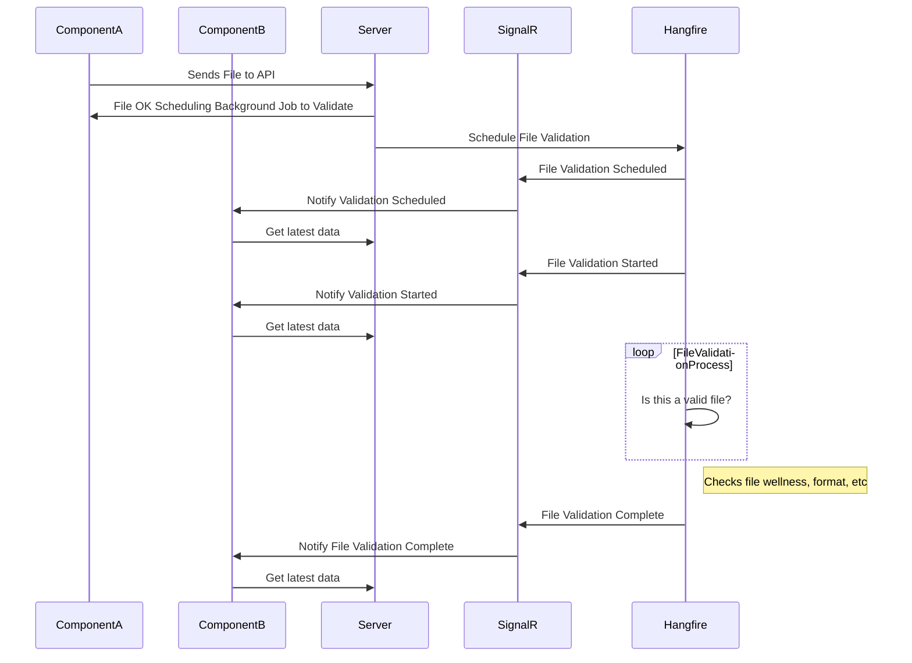

In my experience, simple user experiences (UX) are quite often not so simple.  Given a `user upload feature` that allows the user to upload a file and from that action to `validate` the file and `notify` the user of various status changes.  Okay, maybe, that is not too simple, but to an end-user this task does not `feel` too complex -- or should not be complicated to the end-user.

How do we make this seamless and what does that mean?  I think a lot of applications are seamed in their early stages.  A user clicks on a link → server processes → server returns OK → redirect user to success page.  Seamless UX simplifies this interact for the user to make their experience simple.  

See [SAP Seamless Experience](https://blogs.sap.com/2021/03/24/seamless-user-experience-explained-highlights-from-the-sap-community-call/){:target="_blank"}

## Keys

* Consistent
* No locking of UI
* No sudden interruptions
* Simple

Blazor WASM, SQL Server, Web API, Hangfire, and SignalR can deliver a great seamless experience to the end-user.

## User Upload Feature

| Feature     | Description |
| ----------- | ----------- |
| Upload and Validate | Add the ability to upload a one roster file and have it validate (returns true or false) |


> The complexity of simplicity

[](https://mermaid.live/edit#pako:eNqdVFFv0zAQ_isnP4cpWxPaGWloHQIGEkxU4gHlxTiXxJpjB_syKFX_-5ymxaUqlOGnXO77Pn939nnFpC2RcQZhefzWo5H4SonaifZFYWC7OuFISdUJQ3Bj284aNHR9Ij8_nl-ge0D3h5yqjdCfjiffClNXymHMRivPrq5GXR70TenhtdIIZOH67jbiR0jARiIfkR_fw0I2WPZamRrmQt7XzvamhHf26yDzWWhVCsIjWjtbfKeAo-SWoqyJpB12sDuWyg_Bv1TKvb1G7L7xOYcPllS1PEGNhL0WvUECHarxBIEpnuiPwpn8l7tD4tO8aWu7jZkoeeesRO8j5qCGeDS3HqhRHgQ8DGyogs7LyAtXJgbBOYJTdUNgK4gaNw3Ke7-hwnfU2oStE6isawUlgCT_2sfDNg7Fa_ztRh3r47aNp9n_0kyWsBaDXVWGiV8N3IJRgy0WjIfPEivRaypYYdYBKnqyi6WRjJPrMWF9N0zA9nHY_QyT-cXaEFZC-zFmfMV-MD7Nz55fTNPsIp1k6TTPErZkfHaWpvlslk-yy_zyfJJm64T93PDP149HaXaB)



> Note: Component A and Component B never directly interact with each other.

SignalR is responsible for notifying the connected clients that a create/update has occurred.  It does not necessarily need to be the user executing the action that needs to know the update is occurring.  For instance, a user on the page looking at the uploads will also get this notifications.

## Server SignalR

ImportFileHub.cs

```csharp
using Microsoft.AspNetCore.Authorization;
using Microsoft.AspNetCore.SignalR;

namespace Data.Shared.Hubs;

[Authorize(Roles = "Support Admin")]
public class ImportFileHub : Hub
{

}
```

ImportFileNotificationService.cs

```csharp
using Data.Shared.Hubs;
using Microsoft.AspNetCore.SignalR;
using Services.Interfaces.Notifications;
using System.Threading;
using System.Threading.Tasks;

namespace Services.Implementations.Notifications;

public class ImportFileNotificationService : IImportFileNotificationService
{
    private readonly IHubContext<ImportFileHub> _importFileHub;

    public ImportFileNotificationService(
        IHubContext<ImportFileHub> importFileHub)
    {
        _importFileHub = importFileHub;
    }

    public async Task NotifyAsync(
        ImportFileProcessingStatus status,
        string fileName = "",
        string message = "",
        CancellationToken token = default)
    {
        if (_importFileHub.Clients != null)
        {
            await _importFileHub.Clients.All.SendAsync("ImportFileUpdate", new ImportFileUpdate
            {
                FileName = fileName,
                Message = message,
                Status = status,
            }, cancellationToken: token);
        }
    }
}
```

ImportFileUpdate.cs

```csharp
namespace Data.Shared.Hubs;

public class ImportFileUpdate
{
    public ImportFileProcessingStatus Status { get; set; }
    public string FileName { get; set; }
    public string Message { get; set; }
}
```

This is the main engine for notifying client of `Processing Status` updates.  Consuming on the client side (and I've abstract much of the complexity to a higher level) looks like the following.

We can receive the SignalR message with a custom hub that has an `EventCallBack<ImportFileUpdate> OnFileStatusChange` that will fire when we receive that notification on the client side.

## Client WASM

ImportFilesList.razor

```html
/* Listing Component */
<ImportFileHub OnFileStatusChange="FileStatusChange"/>
```

We will bind that event to a method on our `ImportFilesList` to execute when it occurs → to refresh our data.

ImportFilesList.razor.cs

```csharp
        protected async void FileStatusChange(ImportFileUpdate importFileUpdate)
        {
            await importFilesGrid.Reload();

            switch (importFileUpdate.Status)
            {
                case ImportFileProcessingStatus.Processing:
                case ImportFileProcessingStatus.Scheduled:
                    NotificationService.Notify(NotificationSeverity.Info, "Import File", importFileUpdate.Message);
                    break;
                case ImportFileProcessingStatus.Imported:
                    NotificationService.Notify(NotificationSeverity.Success, "File Import Complete", importFileUpdate.Message);
                    break;
                case ImportFileProcessingStatus.Uploaded:
                    NotificationService.Notify(NotificationSeverity.Success, "File Import Uploaded", importFileUpdate.Message);
                    break;
                case ImportFileProcessingStatus.Validated:
                    NotificationService.Notify(NotificationSeverity.Info, "Import File Validated", importFileUpdate.Message);
                    break;
            }
        }
```
